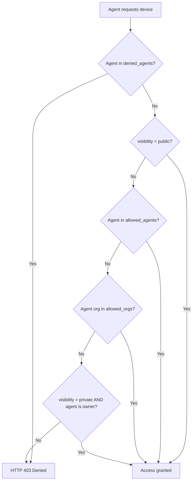

Every device in `oahl-config.json` can carry two policy objects that work together:

- **`access_policy`** — controls *who* can discover and use the device (evaluated by the cloud)
- **`policy`** — controls *how long* and under what conditions a session runs (evaluated by the local node)

## Visibility modes

The `access_policy.visibility` field is the primary switch. It sets the default access level before the allow and deny lists are applied.

<Tabs>
  <Tab title="public">
    Any authenticated agent can discover and request a session on this device. No allow-list is required.

    **Use when:** You are sharing a device openly with the community, running a demo node, or testing agent integration.

    ```json
    "access_policy": {
      "visibility": "public",
      "allowed_agents": [],
      "allowed_orgs": [],
      "denied_agents": []
    }
    ```
  </Tab>
  <Tab title="shared">
    Only agents whose IDs appear in `allowed_agents`, or whose organisation appears in `allowed_orgs`, can use the device.

    **Use when:** You want to share a device with a specific team, partner, or set of trusted agents without making it fully public.

    ```json
    "access_policy": {
      "visibility": "shared",
      "allowed_agents": ["agent-abc123", "agent-def456"],
      "allowed_orgs": ["org-acme"],
      "denied_agents": []
    }
    ```
  </Tab>
  <Tab title="private">
    Only the device owner and agents explicitly listed in `allowed_agents` can access the device. Agents not on the list receive HTTP 403.

    **Use when:** The device is sensitive (e.g., a personal phone, a production instrument) and access should be tightly controlled.

    ```json
    "access_policy": {
      "visibility": "private",
      "allowed_agents": [],
      "allowed_orgs": [],
      "denied_agents": []
    }
    ```
  </Tab>
</Tabs>

---

## Field reference

### `access_policy` fields

<ParamField path="access_policy.visibility" type="string" default="private">
  Controls who can discover and request sessions on this device.

  - `"public"` — any authenticated agent
  - `"shared"` — only agents and orgs on the allow-lists
  - `"private"` — only the owner and explicitly listed agents
</ParamField>

<ParamField path="access_policy.allowed_agents" type="string[]">
  List of agent IDs explicitly permitted to use this device. Evaluated against the `x-agent-id` request header.

  With `visibility: "shared"` or `visibility: "private"`, an agent on this list is granted access regardless of org membership. With `visibility: "public"`, this list has no additional effect.

  ```json
  "allowed_agents": ["agent-abc123", "agent-def456"]
  ```

  <Warning>
  `x-agent-id` is self-asserted in v1 — it is not cryptographically verified. See the [security guide](/security/security-guide#1-self-asserted-agent-identity-headers) for the compensating control.
  </Warning>
</ParamField>

<ParamField path="access_policy.allowed_orgs" type="string[]">
  List of organisation IDs whose agents are permitted to use this device. Evaluated against the `x-agent-org-id` request header.

  Useful for granting access to an entire team without enumerating every agent ID.

  ```json
  "allowed_orgs": ["org-acme", "org-research-lab"]
  ```

  <Warning>
  `x-agent-org-id` is self-asserted in v1. See the [security guide](/security/security-guide#1-self-asserted-agent-identity-headers) for details.
  </Warning>
</ParamField>

<ParamField path="access_policy.denied_agents" type="string[]">
  List of agent IDs that are **always denied**, even if they would otherwise qualify through `allowed_agents` or `allowed_orgs`. Deny rules take precedence over allow rules.

  ```json
  "denied_agents": ["agent-untrusted", "agent-compromised"]
  ```

  <Tip>
  Use `denied_agents` to block a specific agent without changing the visibility mode or rebuilding the entire allow-list. This is the fastest way to revoke access in an incident.
  </Tip>
</ParamField>

### `policy` fields

<ParamField path="policy.max_session_minutes" type="number" default="30">
  Maximum duration in minutes for a single session on this device. The node terminates sessions that exceed this limit.

  Keep this value as low as practical. Short sessions reduce the replay attack window and free the device faster for other agents.

  ```json
  "policy": {
    "max_session_minutes": 15
  }
  ```
</ParamField>

<ParamField path="policy.public" type="boolean" deprecated>
  Legacy shorthand equivalent to `access_policy.visibility: "public"`. When `true`, any agent can use the device.

  This field is kept for backwards compatibility. Prefer `access_policy.visibility` for new configurations. The CLI TUI writes both fields in sync automatically.

  ```json
  "policy": {
    "public": false,
    "max_session_minutes": 30
  }
  ```
</ParamField>

---

## Scenario examples

### 1. Public device (any authenticated agent)

Open access with a 30-minute session cap. Suitable for demo hardware.

```json oahl-config.json
{
  "id": "mock-device-1",
  "type": "mock",
  "adapter": "mock-adapter",
  "capabilities": ["ping", "hardware.baseline"],
  "access_policy": {
    "visibility": "public",
    "allowed_agents": [],
    "allowed_orgs": [],
    "denied_agents": []
  },
  "policy": {
    "public": true,
    "max_session_minutes": 30
  }
}
```

### 2. Shared with specific agents

Only `agent-abc123` and agents from `org-acme` can access this camera. Sessions are limited to 20 minutes.

```json oahl-config.json
{
  "id": "usb-cam-1",
  "type": "camera",
  "adapter": "usb-camera",
  "capabilities": ["capture_image", "hardware.baseline"],
  "access_policy": {
    "visibility": "shared",
    "allowed_agents": ["agent-abc123"],
    "allowed_orgs": ["org-acme"],
    "denied_agents": []
  },
  "policy": {
    "public": false,
    "max_session_minutes": 20
  }
}
```

### 3. Private (owner only)

No agents are on the allow-list. Only the device owner (matched by `owner_id`) can access it.

```json oahl-config.json
{
  "id": "rtl-sdr-1",
  "type": "sdr",
  "adapter": "rtl-sdr-adapter",
  "owner_id": "user-owner-42",
  "capabilities": ["tune", "read_samples", "hardware.baseline"],
  "access_policy": {
    "visibility": "private",
    "allowed_agents": [],
    "allowed_orgs": [],
    "denied_agents": []
  },
  "policy": {
    "public": false,
    "max_session_minutes": 30
  }
}
```

### 4. Public with a blocked agent

The device is public, but `agent-untrusted` is explicitly denied even though it carries a valid API key.

```json oahl-config.json
{
  "id": "mock-device-1",
  "type": "mock",
  "adapter": "mock-adapter",
  "capabilities": ["ping", "hardware.baseline"],
  "access_policy": {
    "visibility": "public",
    "allowed_agents": [],
    "allowed_orgs": [],
    "denied_agents": ["agent-untrusted"]
  },
  "policy": {
    "public": true,
    "max_session_minutes": 30
  }
}
```

---

## How policy is evaluated

The cloud evaluates `access_policy` on every discovery and session-request call. Evaluation happens in the order shown below. The first matching rule wins.



After the cloud grants access and a session is established, the **local `PolicyEngine`** applies a second layer of enforcement before each capability execution:

1. If the capability is in `disabledCapabilities` → deny
2. If `allowedCapabilities` is non-empty and the capability is not listed → deny
3. Otherwise → allow

Capability names are normalised to lowercase before comparison, so `Capture_Image` and `capture_image` are treated identically.

```typescript
export class PolicyEngine {
  isCapabilityAllowed(deviceId: string, capabilityName: string): boolean {
    const policy = this.getPolicy(deviceId);
    if (!policy) return true;

    const requestedCapability = normalizeCapabilityName(capabilityName);
    const disabledCapabilities = (policy.disabledCapabilities || []).map(normalizeCapabilityName);
    const allowedCapabilities = (policy.allowedCapabilities || []).map(normalizeCapabilityName);

    if (disabledCapabilities.includes(requestedCapability)) {
      return false;
    }

    if (allowedCapabilities.length > 0 && !allowedCapabilities.includes(requestedCapability)) {
      return false;
    }

    return true;
  }
}
```

---

## Best practices

<Tip>
Start every new device with `visibility: "private"` and open access only after you have verified the device behaves as expected. It is easier to loosen a policy than to recover from unintended access.
</Tip>

<Tip>
Use `allowed_orgs` instead of enumerating every `allowed_agents` entry when you are granting access to a team. This avoids stale entries when team membership changes.
</Tip>

<Tip>
Set `policy.max_session_minutes` to the minimum duration your agent workflow realistically needs. Short sessions reduce the window for replay attacks and ensure the device is freed promptly for other agents.
</Tip>

<Tip>
Add destructive or dangerous capabilities (e.g., `system.shell`, `app.install`, `sms.send`) to `disabledCapabilities` in the local policy config for any device that is shared or public. The cloud-side `access_policy` controls who can connect; the local `PolicyEngine` controls what they can do once connected.
</Tip>
